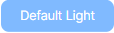
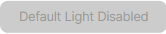
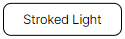
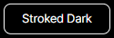
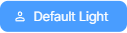

# This documentation is not actual

# UI Button docs
```html
<UIButton>
  Click me
</UIButton>
```

### Button types "`prop:type`"
> `prop:type`: default | stroked
```html
<UIButton type="blue"> <-- Is default -->
  Click me
</UIButton>
```
<div style=">
  
</div>

### Button "`prop:theme`"
```html
<UIButton theme="light"> <-- Is default -->
  Default Light
</UIButton>

<UIButton theme="dark">
  Default Dark
</UIButton>
```
<div style="display: flex; gap: 1rem;">
  
  
</div>

### Button "`prop:disabled`"
```html
<UIButton :disabled="false"> <-- Is default -->
  Default Light
</UIButton>

<UIButton disabled> <!-- Is disabled -->
  Default Light Disabled
</UIButton>
```
<div style="display: flex; gap: 1rem;">
  
  
</div>

### Combine "`prop:type`" and "`prop:theme`"
```html
<UIButton type="stroked" theme="light"> <-- Stroke will be black (#000) -->
  Stroked Light
</UIButton>

<UIButton type="stroked" theme="dark"> <-- Stroke will be white (#fff) -->
  Stroked Dark
</UIButton>
```
<div style="display: flex; gap: 1rem;">
  
  
</div>

### Button with icon
```html
<UIButton>
  Default Light
  <template #icon>
    <SVGProfile />
  </template>
</UIButton>
```
<div style="display: flex; gap: 1rem;">
  
</div>

### Also, it's works with this syntax, but nothing to change
```html
<UIButton>
  <template #icon>
    <SVGProfile />
  </template>
  Default Light
</UIButton>
```
<div style="display: flex; gap: 1rem;">
  
</div>

### Button :hover, :focus, :active (pressed)
```html
<UIButton hovered>  <-- :hover -->
  Hovered
</UIButton>

<UIButton focused>  <-- :focus -->
  Focused
</UIButton>

<UIButton pressed>  <-- :active -->
  Pressed
</UIButton>
```
<div style="display: flex; gap: 1rem;">
  
  
  
</div>